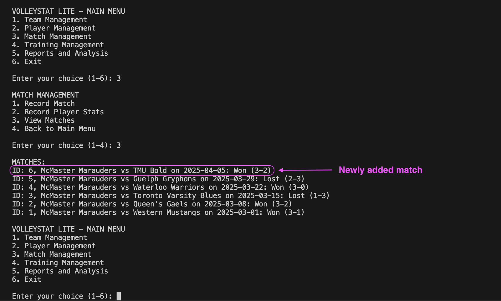

# 🏐 VolleyStat Lite - Volleyball Performance Tracking System

VolleyStat Lite is a comprehensive system for tracking and analyzing volleyball team and player performance data, providing actionable insights, and integrating with both PostgreSQL and Google Sheets for data management and reporting.

## Purpose

This application serves as a performance tracking platform for volleyball coaches, players, and analysts. Drawing inspiration from real-world sports analytics systems, VolleyStat Lite offers tools to record match statistics, analyze performance metrics, and generate targeted training recommendations. The system follows best practices in software architecture and demonstrates the implementation of design patterns in a practical sports management context.

## What Can It Do?

This application helps volleyball teams:
- **Track match results** with detailed set scores and outcomes
- **Record player statistics** including attacks, kills, errors, blocks, digs, and aces
- **Manage teams and players** with position tracking
- **Schedule training sessions** categorized by focus area (serving, attacking, blocking)
- **Generate performance analysis** based on recorded statistics
- **Receive training recommendations** tailored to performance data
- **Export comprehensive reports** to Google Sheets for sharing and additional analysis

Whether you're a coach looking to improve your team's strategy, a player tracking your development, or an analyst identifying performance trends, VolleyStat Lite streamlines the entire volleyball performance management process.

## Feature Showcase!

### Database Integration & Sample Data:

The system seamlessly integrates with PostgreSQL for data storage. Running the sample data population script creates and populates the database with volleyball teams, players, matches, and statistics, providing users with an immediate starting point.

### Sample Data Population Confirmation:

The application verifies successful data population, displaying the match data in PostgreSQL alongside terminal output confirming the creation of teams, players, matches, and statistics.

### Application Interface & Navigation:
|  |  |
|:--:|:--:|
| *Main Menu with Match Management* | *Match Recording Interface* |

The application features an intuitive command-line interface that provides straightforward navigation between different functional areas. The main menu gives access to team management, player management, match recording, training sessions, and analytical reports.

### Observer Pattern Implementation:

The match recording interface demonstrates the Observer pattern in action. When a new match is recorded, notifications are automatically sent to relevant stakeholders. Coaches receive strategic information, players receive performance updates, and analysts obtain data for further evaluation.

### Data Verification & Google Sheets Integration:
|  |  |
|:--:|:--:|
| *Match Verification* | *Export Process* |

After recording data, users can verify entries and export comprehensive reports to Google Sheets for sharing and advanced analysis. The system creates multiple sheets for different data categories and generates a summary dashboard.

### Exported Data Visualization:

Data exported to Google Sheets is formatted for clarity and analysis. The example shows match data with both sample entries and newly added information, demonstrating the complete workflow from data entry to external reporting.

## Behind the Scenes

This application leverages modern software architecture principles and patterns:

| Component | Technologies & Approaches |
|-----------|-------------|
| **Database** | PostgreSQL for persistent data storage |
| **External Integration** | Google Sheets API for shareable reports |
| **Architecture Documentation** | 4+1 View Model (Logical, Process, Development, Physical, Scenarios) |
| **Design Patterns** | Factory Method, Observer, Adapter patterns |
| **User Interface** | Command-line interface with intuitive navigation |
| **Code Organization** | Modular structure with clear separation of concerns |

### Key Design Patterns

1. **Factory Method Pattern:** Creates different types of training sessions (Serving, Attacking, Blocking) without exposing instantiation logic

2. **Observer Pattern:** Notifies coaches, players, and analysts of system events in real-time, as demonstrated in the match recording screenshot

3. **Adapter Pattern:** Provides a unified interface to different third-party services (PostgreSQL and Google Sheets)

## Project Structure

- **volleystat-lite/** - Root directory
  - **adapters/** - Adapter pattern implementations
    - `adapter_base.py` - Base adapter interface
    - `postgres_adapter.py` - PostgreSQL implementation
    - `sheets_adapter.py` - Google Sheets implementation
  - **core/** - Core system functionality
    - `system.py` - Main VolleyStat system
  - **models/** - Domain models
    - `observer.py` - Observer pattern implementation
    - `training_session.py` - Factory pattern implementation
  - **utils/** - Utility functions
    - `db_initializer.py` - Database schema setup
    - `sampleData.py` - Sample data generator
  - `main.py` - Main application entry point
  - `run.py` - Application runner

## Why I Built This:

I created this volleyball performance tracking system based on my 5+ years of experience watching professional volleyball matches and playing as both a club and collegiate athlete. During this time, I noticed a significant disconnect in the statistical analysis approach to improving performance. While data-driven decision making is standard in professional volleyball, it remains uncommon at earlier stages of high-level volleyball progression. 
